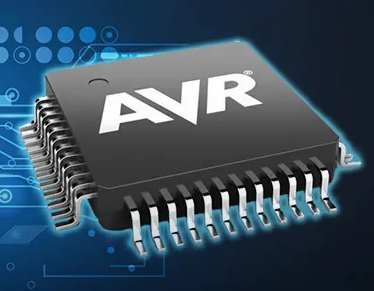
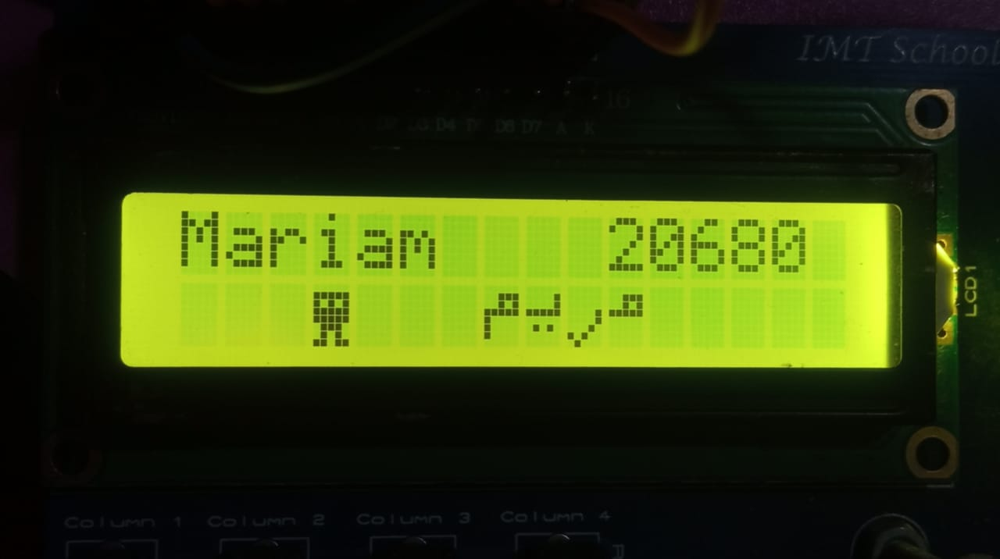

<!--  -->
# Welcome to my AVR drivers branch:    

## 📜Table of Questions :

- [1. MCAL Layer ](#mcal-layer-)
    - [1. MDIO](#1.-mdio)
    - [2. MPORT](#mport)
- [2. HAL Layer ](#hal-layer-)
    - [1. HLED](#hled)
    - [2. HSWITCH](#hswitch)
    - [3. HSEVENSEG](#hsevenseg)
    - [4. HLCD](#hlcd)
    - [5. HKEYPAD](#hkeypad)

## MCAL Layer :
### 1. MDIO
### List of APIs
```c

MDIO_enuErrorStatus_t MDIO_enuSetPinValue(MDIO_enuPortNum_t Copy_enuPortNum,MDIO_enuPinNum_t Copy_enuPinNum,MDIO_enuPinState_t Copy_enuState);

MDIO_enuErrorStatus_t MDIO_enuSetPortValue(MDIO_enuPortNum_t Copy_enuPortNum,u8 Copy_enuPortState);

MDIO_enuErrorStatus_t MDIO_enuGetPinValue(MDIO_enuPortNum_t Copy_enuPortNum,MDIO_enuPinNum_t Copy_enuPinNum,u8* Add_pu8PinValue);

MDIO_enuErrorStatus_t MDIO_enuGetPortValue(MDIO_enuPortNum_t Copy_enuPortNum,u8* Add_pu8PinValue) ;

```
### 2. MPORT
### List of APIs

```c

MPORT_enuErrorStatus_t MPORT_enuSetPinDirection( MPORT_enuPORT_PIN_t Copy_enuPinNum  ,  MPORT_enuPinDir_t  Copy_enuPinDirection  );

MPORT_enuErrorStatus_t MPORT_enuSetPinMode( MPORT_enuPinNum_t Copy_enuPinNum  ,  MPORT_enuPinMode_t Copy_enuPinMode );

MPORT_enuErrorStatus_t MPORT_enuSetPinConfigration(MPORT_enuPortNum_t Copy_enuPortNum,MPORT_enuPinNum_t Copy_enuPinNum,MPORT_enuPinCfg_t Copy_enuConfigration);

MPORT_enuErrorStatus_t MPORT_enuSetPortConfigration(MPORT_enuPortNum_t Copy_enuPortNum,MPORT_enuPortCfg_t Copy_enuConfigration);

```
## HAL Layer :
### 1. HLED
### List of APIs

```c
void HLED_init(void);

HLED_enuErrorStatus_t HLED_enuSetLedState(u8 Copy_u8LedName, HLED_STATE_t Copy_u8State);

```
### 2. HSEVENSEG
### List of APIs

```c
void HSEVENSEG_vInit(void);

HSEVENSEG_enuErrorStatus_t HSEVENSEG_enuSetValue(u8 Copy_enuSevenSegNum , u8 Copy_u8Value);

HSEVENSEG_enuErrorStatus_t HSEVENSEG_enuSetMultiDigitValue(u16 Copy_u16Value);


```

### 4. HLCD
### List of APIs

```c
HLCD_enuErrorStatus_t HLCD_enuInit(void);

HLCD_enuErrorStatus_t HLCD_enuWriteData(u8 Copy_u8Data,u8 Copy_u8LCDNum);

HLCD_enuErrorStatus_t HLCD_enuWriteCommand(u8 Copy_u8Command,u8 Copy_u8LCDNum);

HLCD_enuErrorStatus_t HLCD_enuGoToRowColumn(HLCD_Row_t Copy_enuRow, u8 Copy_enuColumn,u8 Copy_u8LCDNum);

HLCD_enuErrorStatus_t HLCD_enuStoreSpecialChar(u8 * Copy_u8BatternArr,u8 Copy_BatternNum,u8 Copy_u8LCDNum);

HLCD_enuErrorStatus_t HLCD_enuDisplaySpecialChar(u8 Copy_BatternNum,HLCD_Row_t Copy_enuRow, u8 Copy_enuColumn,u8 Copy_u8LCDNum);

HLCD_enuErrorStatus_t HLCD_enuWriteString(u8 * Add_String,u8 Copy_u8LCDNum);

HLCD_enuErrorStatus_t HLCD_enuWriteNumber(s64 Copy_Number,u8 Copy_u8LCDNum);

```
## Example of LCD App


### 5. HKEYPAD
### List of APIs

```c

extern HKEYPAD_enuErrorStatus_t HKEYPAD_enuInit(void);
extern HKEYPAD_enuErrorStatus_t HKEYPAD_enuGetPressedKey(u8 * Add_u8PressedKey,u8 Copy_u8KeypadNum);

```


 _**Author**_

_**Mariam Hossam**_

_**ITI student**_